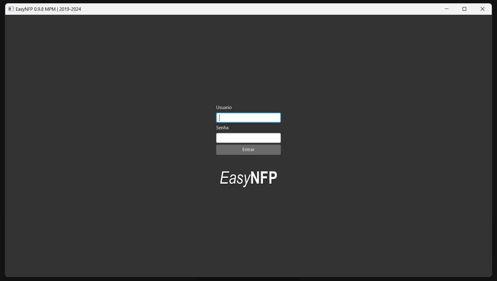
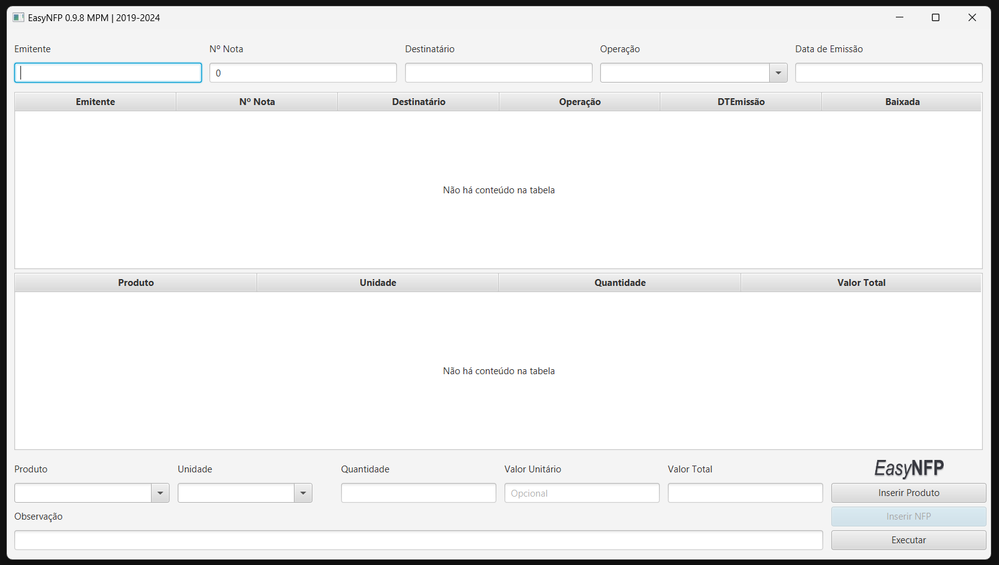

# Easy NFP 

### Programa desenvolvido com a finalidade de facilitar e acelerar substancialmente o processo de baixa de notas fiscais do produtor rural - NFP.

   

Pouco tempo após começar a aprender a desenvolver em java, recebi uma nova atribuição no meu trabalho. Gerenciar o Sistema do Produtor Rural - SPR, além das rotinas de cadastro e alteração de imóveis rurais e produtores, existia uma grande demanda para efetuar a baixa de notas fiscais (efetuar o lançamento das notas no sistema da receita estadual), tarefa não muito agradável e repetitiva. O município na época, devia cerca de 13.000 notas fiscais para a receita, além das que chegavam aos montes todos os dias, e o quadro não dispunha de pessoal suficiente. Tempos difíceis.. 

Foi onde surgiu a idéia inicial e necessidade do EasyNFP. Programa que viria a solucionar meu problema no serviço, assim como aprimorar meu aprendizado em programação. Após inumeros esboços, vídeos, tutoriais, consultas ao reddit,.. consegui colocar em execução. Um programa que automatizava o lançamento das notas fiscais, simplesmente eliminando toda a redundância das notas, sim! Era possível encontrar até 200 notas fiscais, do mesmo produtor (cadpro), enviando para o mesmo emitente (inscrição estadual/cnpj), com o mesmo produto e até valor!.. O EasyNFP facilita o preenchimento dos dados, com layout intuitivo e ferramentas que aceleram a inserção dos dados, que com a ajuda do SELENIUM são lançadas no sistema da receita. Tornando possível executar o trabalho de semanas, em minutos. Assim criei tempo para continuar aprendendo e me aperfeiçoando no que realmente gostava de fazer, que era programar. 

Hoje com mais de 32.000 notas lançadas como auxilio do EasyNFP, o município já praticamente não possui pendências com a receita estadual e com a substituição para as Notas Fiscais Eletrônicas, logo o EasyNFP será descontinuado, porém o manterei aqui, como forma de nunca esquecer o quanto esse programa me ajudou.

**Login Screen** - Tela inicial do programa, apenas usuários cadastrados e ativos no Atlas (mongodb) poderiam se conectar ao programa.
Senhas não eram armazenadas, por serem as mesmas que acessam a plataforma do SEFANET.

**App screen** - Após validação do login o usuário era direcionado para a tela principal. Campos organizados de maneira intuitiva, acompanhando a forma em que a nota era lida pelo operador; Dados persistentes, capacidade de fixar o valor do produto e/ou observações, auto incrementação da numeração da nota; Auto-complete nas dropboxes, sempre focando na optimização e agilidade na inserção de notas sequenciais. 

Inicialmente o programa era focado em notas de aviários e matrizeiros, pelo grande volume e dados semelhantes em boa parte do material. Posteriormente devido uma grande alta na produção de hortaliças e legumes no município, adicionei a possibilidade de incluir diversos itens em uma nota *(haviam produtores que chegavam a comercializar até 8 produtos com apenas 1 nota)*.

**Preview** - Após a inserção simplificada pelo operador, o EasyNFP gerava uma fila de notas a serem baixadas com a ajuda do Selenium, a partir deste ponto era só aguardar. Inclusive podendo alternar a janela e continuar utilizando o computador.  
